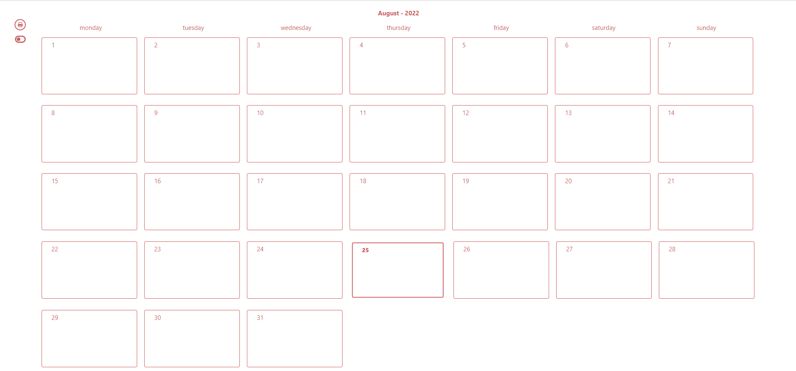
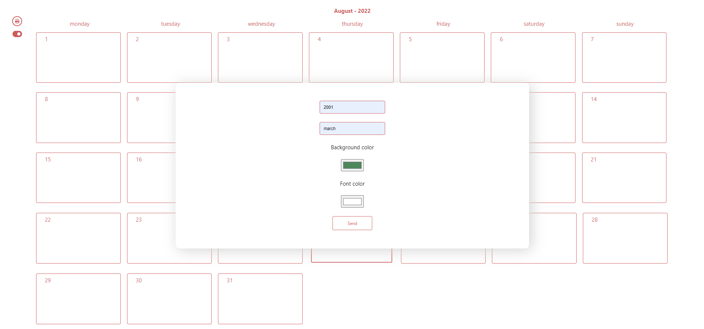
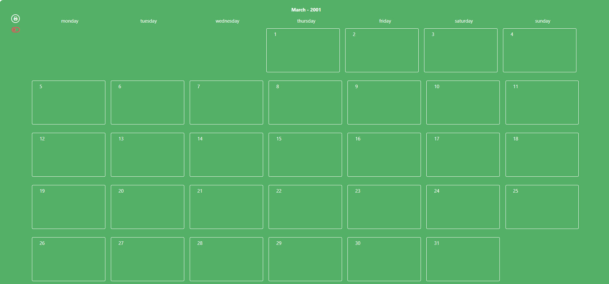
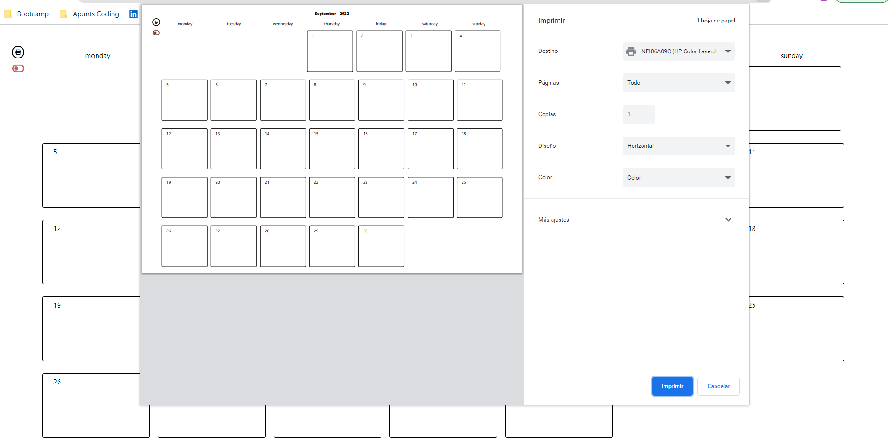

# Calendar Printer 🗓🖨
Vanilla JavaScript  project developed so my mum can print her own calendar instead of asking me to do so every month.

#### Link to GitHub Pages: 

[](https://afonttorres.github.io/calendar/)

## Tech Stack
+ HTML 5
+ CSS 3
+ ES6 (Vanilla Java Script)

### Version control
+ GIT
+ Git Hub

### Development tools & libraries
+ Visual Studio Code

## Objectives and Features
The objective of this project is to print either the present month calendar or a choosen one and be able to change its colors by chosing both date and theme in a form. If the current month is the one displayed, current day display will be lightly different.

Actually was a mock application to joke with my mum but I would like to take it serious and refactor the code as well as add some features to it.

Some of these new features would be adding events or tasks and be able to update, delete and drag and drop them to change its date.


## Preview





## Authors
 
[](https://www.linkedin.com/in/agnes-font-torres/)
[@afonttorres](https://github.com/afonttorres)

## Installation

#### 1. Clone the repository
```bash
 https://github.com/afonttorres/calendar.git
```


#### 2. Run the app by opening it in your favourite server or browser.


